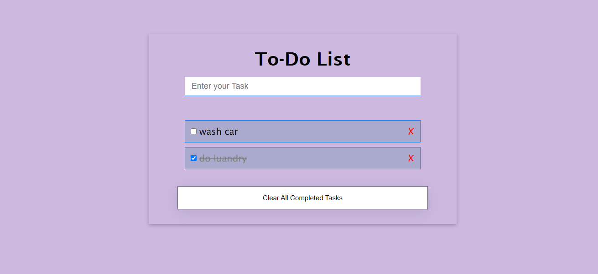

# Project Name: To-Do List App

> Frontend environment for building JavaScript applications. in this project i built a To-Do List App

</img>

## Built With

- JavaScript
- CSS
- HTML
- Webpack 
- Github

## Live Demo (if available)

[Live Demo Link](https://hsmathebula.github.io/To-Do-List-App/)

## Getting Started

- Open terminal
- Clone this project by the command: $ git clone https://github.com/HSMathebula/Awesome-books-plain-JavaScript-with-objects.git

- Then go to the main folder using the next command: $ cd capstone1.git

- Finally, run diplay the index.html file in your local browser, or also, you can use Live Server in Visual Studio Code.

To get a local copy up and running follow these simple example steps.

### Prerequisites

-Create Github repository
-Have VSCode or choice text editor installed
-Have Git installed
-HTML/CSS Linters
-Good github workflow
-open index.html file .

### Setup

-Git clone git@github.com:https://github.com/HSMathebula/To-Do-List-App.git
-cd To-Do-List-App
-open file in preferred editor
-Edit to your satisfaction
-HTML, CSS Linter configuration - https://github.com/microverseinc/linters-config/tree/master/html-css

### Install

- npm install

### Usage

- For anyone who wants to practice html5, css3 and or vanilla JavaScript.
- For anyone who wants to create his own Web devlopment course site.

### Run tests

- run: npx hint .
- run: npx stylelint "**/*.{css,scss}"
- run: npx eslint .
- run: npm run build - to build project
- run: npm run dev - to compile

## Authors

👤 **Author1**

- GitHub: [@githubhandle](https://github.com/HSMathebula)

## 🤝 Contributing

Contributions, issues, and feature requests are welcome!

Feel free to check the [issues page](../../issues/).

## Show your support

Give a ⭐️ if you like this project!

## Acknowledgments

- Hat tip to anyone whose code was used
- Inspiration
- etc

## 📝 License

This project is [MIT](./MIT.md) licensed.
